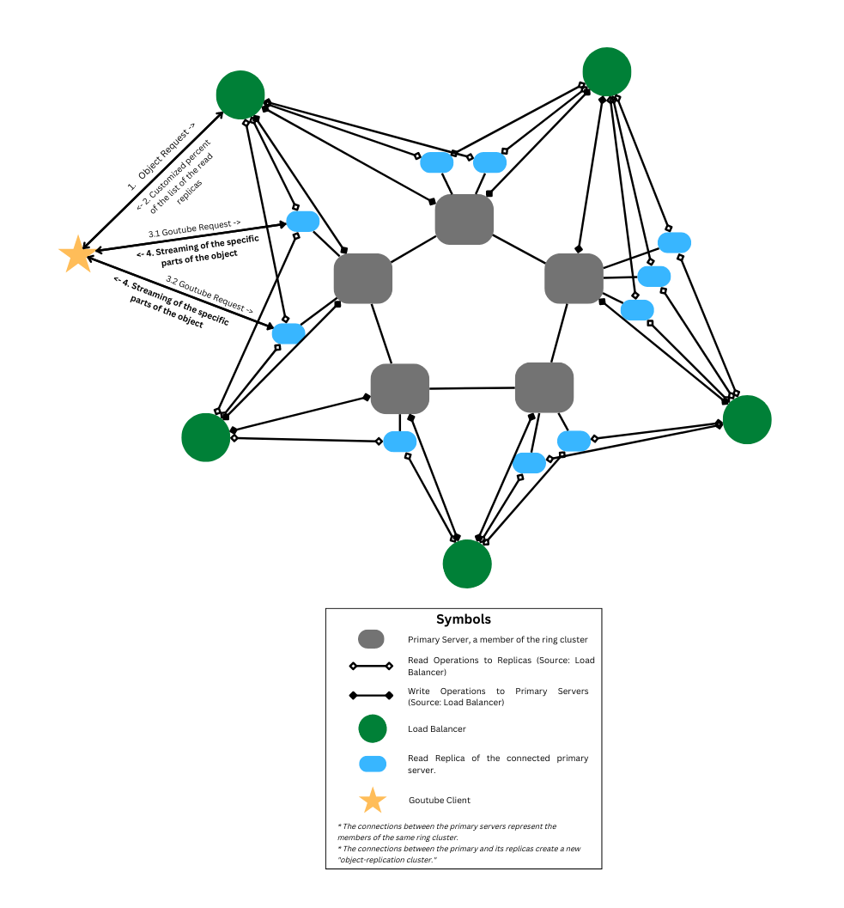

# Goutube

Streaming utility to build largely-scalable, highly available, fast, and secure ***distributed*** streaming APIs!

### **Why build this? What's new here?**

- Simple reason is that distributed systems are cool because of many reasons and some of these reasons are
  largely-scalability, high
  availability, secure, and fast.
- With this project, I attempt to go in-depth on how to build a system that grows in functionality as well as users and
  the team developing it.
- It's my attempt to broaden my knowledge and make it strong by developing this real-world end-to-end product.

### **Why choose Go?**

- Simplicity
- Strongly typed and compiled
- Compiles to a single binary with no external dependencies
- Fast and lightweight
- Good coding practices
- Excellent support for network programming and concurrency
- Easy to deploy

### Prerequisites

- Go 1.16+

## Configuration parameters

| Parameters         | Type                                                                             | Usage                                                                                                                                                                                  |
|--------------------|----------------------------------------------------------------------------------|----------------------------------------------------------------------------------------------------------------------------------------------------------------------------------------|
| DataDir            | string                                                                           | Path to the directory to store data locally.                                                                                                                                           |
| BindAddr           | string                                                                           | The address that Goutube will bind to for communication with other members on the ring.                                                                                                |
| RPCPort            | int                                                                              | The port that Goutube will bind to for the member's RPC server.                                                                                                                        |
| ReplicationPort    | string                                                                           | If this server allows replication (by setting the ParticipationRule). This is the port where leader and its follower will communicate to sync with each other. (eventually consistent) |
| NodeName           | string                                                                           | Unique node name to identify this member.                                                                                                                                              |
| SeedAddresses      | []string                                                                         | Addresses of other members to join the ring upon start up.                                                                                                                             |
| VirtualNodeCount   | int                                                                              | Number of virtual nodes to create on the ring for this member.                                                                                                                         |
| ACLModelFile       | string                                                                           | Path to the model file for authorization using [casbin](https://github.com/casbin/casbin)                                                                                              |
| ACLPolicyFile      | string                                                                           | Path to the policy file for authorization using [casbin](https://github.com/casbin/casbin)                                                                                             |
| ServerTLSConfig    | *tls.Config                                                                      | To configure the server for authentication.                                                                                                                                            |
| PeerTLSConfig      | int                                                                              | To configure the client for authentication (to connect to other servers for replication, forwarding, etc.)                                                                             |
| LeaderAddresses    | []string                                                                         | Hash function to calculate position of the server on the ring.                                                                                                                         |
| Rule               | [ParticipationRule](https://github.com/Brijeshlakkad/goutube/blob/main/types.go) | Participation rule to define the boundary and extension of the server.                                                                                                                 |
| MaxChunkSize       | uint64                                                                           | Size of the chunk that can be processed by this server.                                                                                                                                |
| MultiStreamPercent | int                                                                              | Percents of the number of followers to return upon GetMetadata request?                                                                                                                |

### Goutube Architecture

### **Can I contribute to this project?**

Feel free to create a PR, I’m more than happy to review and merge it.

### **What's the long-term goal?**

- Onboard videos and documentation
- Clean code, full test coverage and minimal tech debt

# Thank you!

Feel free to create an issue, if you have any problem running this distributed system or any suggestions.